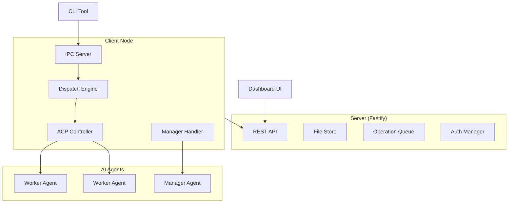

# AgentDispatch

A task dispatch platform for AI agents, supporting automated task distribution, execution monitoring, and artifact management.

## Architecture



AgentDispatch uses a CS-style distributed architecture:

| Module | Description |
|--------|-------------|
| **Server** | Task hub with REST API, file-based persistence, auth, and SSE streaming |
| **ClientNode** | Client runtime managing Agent clusters via ACP protocol |
| **ClientCLI** | Command-line interface for Node control and Worker communication |
| **Dashboard** | Web-based visualization for tasks, clients, and real-time monitoring |
| **Shared** | Cross-module types, errors, and utilities |

## Quick Start

### Prerequisites

- Node.js >= 20.0.0
- pnpm >= 9.15.0

### Setup

```bash
git clone <repo-url> && cd AgentDispatch
pnpm install
pnpm build
```

### Start the Server

```bash
pnpm --filter @agentdispatch/server dev
# Server starts at http://localhost:9800
```

### Start the Dashboard

```bash
pnpm --filter @agentdispatch/dashboard dev
# Dashboard at http://localhost:3000
```

### Create Your First Task

```bash
curl -X POST http://localhost:9800/api/v1/tasks \
  -H "Content-Type: application/json" \
  -d '{"title": "Hello World", "tags": ["test"], "priority": "normal"}'
```

## Development

```bash
pnpm build        # Build all packages
pnpm test         # Run all tests
pnpm test:e2e     # Run E2E integration tests
pnpm lint         # Lint all packages
pnpm type-check   # Type-check all packages
pnpm clean        # Clean all build outputs
```

## Project Structure

```
packages/
  server/          # REST API server (Fastify)
  client-node/     # Client runtime (ACP, IPC, dispatch engine)
  client-cli/      # CLI tool (commander)
  dashboard/       # Web UI (React + Vite + shadcn/ui + Tailwind)
  shared/          # Shared types and utilities
docs/              # User documentation
tests/e2e/         # E2E integration tests
```

## Documentation

| Guide | Description |
|-------|-------------|
| [Installation](docs/guide/installation.md) | Setup and getting started |
| [Configuration](docs/guide/configuration.md) | Server, Client, and Agent configuration |
| [Task Management](docs/guide/task-management.md) | Creating, monitoring, and completing tasks |
| [Dispatch Modes](docs/guide/dispatch-modes.md) | tag-auto, manager, and hybrid modes |
| [Authentication](docs/guide/authentication.md) | Tokens, roles, and security |
| [API Reference](docs/api.md) | Complete REST API documentation |
| [CLI Reference](docs/cli.md) | Command-line interface reference |

## Configuration

- Server: `server.config.json` (default port: 9800)
- Client: `client.config.json`
- Environment variables: `DISPATCH_*` prefix

See [Configuration Guide](docs/guide/configuration.md) for details.

## License

Private
