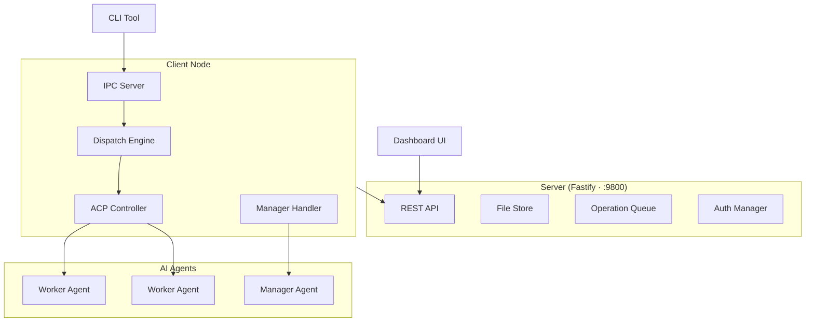

# AgentDispatch

**AI Agent 任务分发平台** — 支持自动化任务分配、多模式调度、ACP 协议通信、实时监控与产物管理。

> 让任何支持 [ACP (Agent Client Protocol)](https://github.com/anthropics/agent-client-protocol) 的 AI Agent 即插即用，接入统一的任务执行集群。

---

## 主要功能

### 核心能力

| 功能 | 说明 |
|------|------|
| **任务全生命周期** | Create → Claim → Progress → Complete / Fail / Cancel，文件级持久化 |
| **三种分发模式** | `tag-auto`（规则匹配）、`manager`（AI 调度顾问）、`hybrid`（混合策略） |
| **ACP 协议集成** | 基于 JSON-RPC 2.0 over stdio，Worker/Manager Agent 均通过 ACP 通信 |
| **产物管理** | zip + result.json 标准交付格式，8 步服务端校验 |
| **实时推送** | SSE Streaming（`GET /tasks/:id/stream`），Dashboard 自动刷新 |
| **认证鉴权** | Token-based 角色体系（admin / client / operator），Worker 独立 Token |
| **心跳与容错** | 客户端心跳超时自动标记 offline，Worker 崩溃自动释放任务 |
| **可视化 Dashboard** | 任务看板、节点监控、进度追踪、产物下载 |

### 架构概览



### 分发模式

```
tag-auto 模式:  Server 任务 ──[tag 规则匹配]──→ 空闲 Worker 自动执行
manager 模式:   Server 任务 ──[ACP 咨询 Manager]──→ Manager 建议 ──→ Worker 执行
hybrid 模式:    Manager 在线 → 走 manager；离线 → 回退 tag-auto
```

---

## 项目进度

| 里程碑 | 状态 | 版本 | 说明 |
|--------|------|------|------|
| M0 — 工程基线 | ✅ Done | — | Monorepo + CI + 质量门禁 |
| M1 — Server MVP | ✅ Done | v1.0-alpha | Task/Client 核心 API + 文件持久化 |
| M2 — ClientNode + CLI | ✅ Done | — | 节点注册、心跳、IPC 控制 |
| M3 — Worker 执行闭环 | ✅ Done | v1.0 | ACP 通信 + 产物提交 + 端到端链路 |
| M4 — 分发引擎 V1 | ✅ Done | v1.5 | tag-auto / manager / hybrid 三模式 |
| M5 — Dashboard MVP | ✅ Done | — | 任务看板 + 节点监控 |
| M6 — 稳定化与发布 | 🔧 In Progress | v2.0 | 回归测试、文档、发布检查 |

> **当前聚焦**：M6 — 全量 E2E 回归测试、Manager ACP 集成优化、用户文档完善、版本发布。

---

## Quick Start

### 方式一：AI 辅助安装（推荐）

将以下指令复制发送给你的 AI Agent（Cursor / Claude Code / Cline 等即可）：

> 请先通过网络读取 `https://raw.githubusercontent.com/blackplume233/AgentDispatch/master/docs/guide/ai-assisted-setup.md`，然后按照文档中的三个阶段，帮我完成 AgentDispatch 的安装和配置。

AI 会自动完成环境检测、依赖安装和 Server 启动，然后引导你选择 Worker Agent、配置分发规则并验证端到端流程。

---

### 方式二：手动安装

#### 前置条件

- **Node.js** >= 20.0.0
- **pnpm** >= 9.15

```bash
node --version   # 确认 v20+
pnpm --version   # 确认 9.15+
```

#### 安装与构建

```bash
git clone https://github.com/anthropics/agent-dispatch.git
cd AgentDispatch
pnpm install
pnpm build
```

#### 启动服务

**1. 启动 Server**

```bash
pnpm --filter @agentdispatch/server dev
# Server running at http://localhost:9800
```

**2. 启动 Dashboard**

```bash
pnpm --filter @agentdispatch/dashboard dev
# Dashboard at http://localhost:3000
```

**3. 配置并启动 Client Node**

创建 `client.config.json`（完整字段参见 [配置指南](docs/guide/configuration.md)）：

```json
{
  "name": "my-node",
  "serverUrl": "http://localhost:9800",
  "tags": ["general"],
  "dispatchMode": "tag-auto",
  "autoDispatch": {
    "rules": [
      { "taskTags": ["general"], "targetAgentId": "worker-01", "priority": 1 }
    ]
  },
  "agents": [
    {
      "id": "worker-01",
      "type": "worker",
      "command": "claude-agent-acp",
      "workDir": "./workspace/worker-01",
      "capabilities": ["general"],
      "permissionPolicy": "auto-allow"
    }
  ]
}
```

```bash
pnpm --filter @agentdispatch/client-node dev
```

#### 创建第一个任务

```bash
curl -X POST http://localhost:9800/api/v1/tasks \
  -H "Content-Type: application/json" \
  -d '{"title": "Hello World", "tags": ["general"], "priority": "normal"}'
```

#### CLI 常用命令

```bash
pnpm exec dispatch --help           # 查看所有命令
pnpm exec dispatch task list         # 列出任务
pnpm exec dispatch agent list        # 列出 Agent
pnpm exec dispatch node status       # 查看节点状态
```

---

## 技术栈

| 层 | 技术 |
|----|------|
| **Server** | Fastify · zod · file-based persistence |
| **Client Node** | @agentclientprotocol/sdk · Named Pipe / Unix Socket IPC |
| **CLI** | Commander.js |
| **Dashboard** | React 19 · Vite 6 · React Router 7 · TanStack Query · shadcn/ui · Tailwind CSS |
| **Shared** | TypeScript · zod |
| **工具链** | pnpm workspace · tsup · vitest · ESLint · Prettier |
| **CI** | GitHub Actions (Linux + macOS + Windows · Node 20) |

---

## 项目结构

```
AgentDispatch/
├── packages/
│   ├── server/          # REST API 服务 (Fastify)
│   ├── client-node/     # 客户端运行时 (ACP, IPC, Dispatch Engine)
│   ├── client-cli/      # CLI 工具 (commander) — 二进制名: dispatch
│   ├── dashboard/       # Web UI (React + Vite + shadcn/ui)
│   └── shared/          # 跨模块类型、错误、工具函数
├── docs/                # 用户文档
│   ├── guide/           # 使用指南
│   ├── api.md           # REST API 参考
│   └── cli.md           # CLI 命令参考
├── tests/e2e/           # E2E 集成测试
└── .trellis/            # 项目管理 (Spec, Roadmap, Tasks)
```

---

## 开发命令

```bash
pnpm build          # 构建全部 packages
pnpm test           # 运行全部测试
pnpm test:changed   # 仅运行受变更影响的测试（增量）
pnpm test:e2e       # 运行 E2E 集成测试
pnpm lint           # 全仓 Lint 检查
pnpm type-check     # 全仓类型检查
pnpm clean          # 清理构建产物
```

---

## 文档

| 文档 | 说明 |
|------|------|
| [安装指南](docs/guide/installation.md) | 环境准备与组件启动 |
| [配置指南](docs/guide/configuration.md) | Server / Client / Dashboard / Agent 配置详解 |
| [故障排查](docs/guide/troubleshooting.md) | 部署常见问题与解决方案 |
| [任务管理](docs/guide/task-management.md) | 任务创建、监控与交付 |
| [分发模式](docs/guide/dispatch-modes.md) | tag-auto / manager / hybrid 详解 |
| [认证鉴权](docs/guide/authentication.md) | Token、角色与安全 |
| [API 参考](docs/api.md) | 完整 REST API 文档 |
| [CLI 参考](docs/cli.md) | 命令行接口参考 |

---

## 配置

| 配置文件 | 默认位置 | 说明 |
|----------|----------|------|
| `server.config.json` | 项目根目录 | Server 端口、数据目录、认证等 |
| `client.config.json` | 工作目录 | Client Node 连接、分发规则、Agent 定义 |
| 环境变量 | — | `DISPATCH_*` 前缀，覆盖配置文件 |

详见 [配置指南](docs/guide/configuration.md)。

---

## 故障排查

| 问题 | 快速方案 |
|------|---------|
| 端口被占用 / 重复进程 | `lsof -i :9800` 找到并终止残留进程；使用 pm2 管理 |
| Dashboard 远程访问 "Unable to connect" | 启动时设置 `VITE_API_URL=http://<server-ip>:9800` |
| 嵌套 Claude 会话报错 | 用包装脚本 `unset CLAUDECODE` 后再启动 |
| inotify 限制（Linux） | `sudo sysctl fs.inotify.max_user_instances=8192` |

详见 [故障排查指南](docs/guide/troubleshooting.md) 和 [配置指南](docs/guide/configuration.md)。

---

## License

Private
